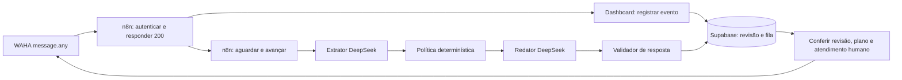

# Atendimento IA V2 — revisão e operação

Branch: `feat/ai-attendance-v2`, criada a partir da `main` atualizada em `d0ffafd`.
Validação local: 25/09/2026. Esta entrega não aplica migrations, importa workflows,
altera configurações remotas, publica a aplicação ou faz merge.

## Diagnóstico do fluxo anterior

- A fila tinha prioridade sobre mensagens novas, sem revisão vinculada ao envio.
  Uma resposta antiga podia sair depois de uma correção do lead.
- `fromMe` era descartado no n8n e no servidor; atendimento manual não pausava a IA.
- O lease não identificava seu proprietário. Uma execução antiga podia liberar outra.
- O modelo misturava extração, resposta e status; campos importantes podiam faltar na qualificação.
- `unknown_fields` acumulava valores mesmo depois de uma informação válida chegar.
- O nome do perfil do WhatsApp era gravado como nome confirmado.
- Falhas do modelo marcavam entradas como processadas. Não havia retry no mesmo turno.
- Assumir/retomar não resolvia o backlog; cancelamentos eram registrados como falhas.
- `always_on=false` não aplicava uma agenda real. Áudio e imagem sem texto eram ignorados.
- A notificação era marcada antes da confirmação do envio e sem reserva atômica.

## Arquitetura implementada

`ai_v2_transition` serializa alterações por conversa com bloqueio de linha. O lease
tem token de proprietário e prazo de 180 segundos. Cada entrada relevante incrementa
a revisão e cancela `queued`/`typing`. Geração, gravação de fatos/fila e envio conferem
a revisão novamente. O estado `sending` impede repetir uma entrega em andamento.
Uma confirmação tardia pode ser registrada mesmo depois de uma intervenção humana.

O eco da IA é reconhecido pelo ID do provedor. Quando chega antes do retorno HTTP,
fica em `ai_pending_echoes`; a confirmação concilia esse ID. Ecos não correspondentes
acionam atendimento humano. Não usamos igualdade de texto para decidir que uma
mensagem foi enviada pela IA.

Assumir cancela a fila e registra entradas pendentes como `handled_by_human` na
mesma transação. Retomar registra `ai_resumed_at`, preserva o histórico e responde
somente a entradas novas. Eventos com data anterior à retomada também são ignorados
para geração. Uma solicitação de encaminhamento feita ao assistente recebe uma
confirmação final; depois dela, a IA para. Uma intervenção manual cancela inclusive
essa confirmação se ainda estiver na fila.

O extrator usa temperatura 0,1 e Zod: fatos, evidência literal, correções,
desconhecidos, intenção, pedido humano e confiança. Não produz resposta ou status.
O servidor valida evidências e decide a qualificação. O redator usa temperatura 0,4
e escolhe variações de respostas autorizadas pelo servidor. Texto livre do modelo
não entra na fila. Essa composição limitada é intencional: uma segunda avaliação
probabilística não seria uma garantia contra alegações inventadas.

Quitado encerra a qualificação. Financiamento confirmado e modelo do veículo são
obrigatórios; ano, banco, dívida e situação das parcelas exigem valor ou desconhecido
explícito. Se há atraso, a quantidade também precisa ser informada ou desconhecida.
Dados corrigidos substituem os anteriores e removem o campo de `unknown_fields`.
`pushName` fica exclusivamente em `whatsapp_display_name` para entradas novas.
Nomes históricos são preservados, pois sua procedência não pode ser reconstruída.

O prompt salvo continua preservado, mas controla apenas o tom. A base estruturada
guarda empresa, serviço, compra/não compra, regiões, horários, documentos, FAQ,
regras, fatos permitidos, promessas proibidas e encaminhamento. Regras livres não
substituem a política de qualificação. FAQ nesta versão exige correspondência da
pergunta cadastrada; documentos/horários/regiões têm intenções próprias. Promessas
proibidas são conferidas também na resposta e na confirmação fora do horário.

Timeout, falha de rede, 429 e 5xx do DeepSeek recebem até duas novas tentativas,
com espera crescente e variação aleatória. 401/403/402 e configuração inválida não
são repetidos. JSON semanticamente inválido encerra o turno com erro visível.
Entradas permanecem no histórico como `processing_failed`, com encaminhamento
humano. Não são marcadas como respondidas. Rajadas acima do limite de processamento
também são preservadas para a equipe.

O status de processamento é separado do status comercial. `ai_processing_events`
registra revisão, decisão, modelo, tempo, código de erro, nomes dos campos extraídos
e ator de intervenções; não registra credenciais, prompts ou conteúdo integral.
A leitura tem RLS para o próprio cliente e administrador ativo. As transições são
executáveis somente pelo servidor com `service_role`.

## Migration

`supabase/migrations/20260924173314_ai_attendance_v2.sql`

Alterações exclusivamente em estruturas de IA: novos campos nas três tabelas
existentes, estados de mensagem, auditoria, ecos pendentes, RPC e cancelamento ao
desligar a IA. Mantém prompt, parâmetros existentes, histórico, nomes, status,
notificações e conexões. Não liga a IA de nenhuma conta. A trava de Plano Completo
existente é mantida, e a RPC também verifica o plano.

A migration foi executada em PostgreSQL local via PGlite, inclusive com dados
anteriores para verificar preservação. **Não foi aplicada em produção.** O arquivo
tem timestamp anterior a algumas migrations já existentes no repositório: na
implantação, aplicar especificamente esta migration pelo procedimento habitual e
conferir o histórico; não executar um `db push --include-all` sem revisar a lista.

## n8n: atualização após aprovação da implantação

1. Exportar uma cópia do workflow atual de Atendimento IA e pausar somente esse
   workflow. Esperar encerrar/cancelar suas execuções antigas. Não parar os workflows
   de ingestão/CAPI.
2. Aplicar a migration aprovada e publicar a aplicação compatível antes de ativar
   o workflow novo. Não rodar V1 e V2 simultaneamente sobre a mesma fila.
3. Importar `n8n/n8n_waha_atendimento_ia.json` no workflow de Atendimento IA.
   Manter somente um webhook ativo com o path `waha-atendimento-ia`.
4. No webhook e nos dois nós HTTP, selecionar a credencial **Header Auth** com
   `X-TrafegoAcademy-Secret` e o segredo já configurado no WAHA/dashboard.
   Não colocar a chave em JSON, Code ou parâmetros do corpo.
5. Conferir o domínio nos endpoints `/whatsapp/ia/evento` e `/whatsapp/ia/passo`.
   Os nós HTTP usam `Generic Credential Type / Header Auth`.
6. O nó de avanço tem timeout de 165 segundos; a rota tem orçamento de 150 segundos.
   Conferir se a hospedagem e o proxy admitem esses tempos. Os timeouts do modelo
   são 20s por extração e 10s por redação, com no máximo três tentativas por chamada.
7. Manter `saveDataSuccessExecution=none`, `saveDataErrorExecution=none`,
   `saveManualExecutions=false`, sem pin data. O loop tem limite de 120 iterações.
   O n8n pode persistir estado temporário de execuções em espera; esses parâmetros
   evitam guardar o histórico final, não eliminam a persistência necessária ao Wait.

O n8n agora transporta também `fromMe`, timestamp e tipo de mídia. Toda decisão de
relevância fica no backend. Não há modelo, prompt, política de negócio, acesso ao
banco ou chave do DeepSeek no workflow.

## WAHA: configuração necessária

Consulta somente de leitura ao ambiente instalado: **WAHA 2026.6.2, GOWS, CORE**.
Não foram alteradas sessões nem enviados WhatsApps reais nesta revisão.

O site configura automaticamente o webhook **exclusivo do Atendimento IA** com
`events: ["message.any"]`, URL e cabeçalho autenticado ao conectar/reconectar cada
sessão. Esse evento inclui mensagens recebidas e
enviadas pelo próprio número. Não alterar o webhook de ingestão de leads nem o de
status da sessão. A documentação oficial confirma suporte a `message.any` no GOWS:
[eventos WAHA](https://waha.devlike.pro/docs/how-to/events/).

**Configuração global:** o padrão é
`https://automacaoowpp-n8n.xtto29.easypanel.host/webhook/waha-atendimento-ia`.
O campo de webhook da IA em Admin → Configurações → WAHA permite sobrescrever
essa URL uma única vez para todos os clientes. Campo vazio usa o padrão.
Um único workflow atende todas as sessões; o backend identifica o cliente pelo
nome da sessão cadastrado no banco. Não duplicar o workflow por cliente.

Após publicar esta atualização, sessões existentes precisam passar uma vez pelo
botão conectar para receber a configuração nova. Novas conexões e reconexões já
registram `message.any` automaticamente; não é mais necessário ajustar o evento
manualmente no WAHA. A inscrição de Conversões continua usando `message`.

Áudio tem uma fase posterior explícita: a interface `AudioTranscriber` e
`prepareTurnInput` aceitam transcrição confiável no mesmo fluxo de texto, mas nenhum
serviço de transcrição foi implantado. A opção prevista é faster-whisper na VPS,
com recuperação de mídia validada contra a API instalada. Hoje o histórico mostra
`🎤 Áudio` e pede alternativa em texto. Imagem/documento recebe confirmação e
encaminhamento, sem afirmar que o conteúdo foi entendido. Não há upload de mídia
para um endpoint inventado.

## Painel

- Base de conhecimento com campos separados; prompt anterior preservado.
- Dias, início/fim, fuso e mensagem fora do horário. Atendimento 24h continua
  prevalecendo quando ligado. A confirmação é enviada uma vez por período fechado.
- Status comercial e situação do atendimento apresentados separadamente.
- Histórico distingue Lead, IA e Equipe; mídia e entregas incertas ficam visíveis.
- Assumir/retomar explica que a retomada vale apenas para novas mensagens.
- Lista atualiza quando a aba está visível; campos desconhecidos têm rótulos legíveis.
- Plano Essencial continua bloqueado visualmente, nas ações do servidor e no banco.

## Verificação

- `npm run test:conversions`: **66 testes existentes passaram**.
- `npm run test:ai`: testes de política, schema, mídia, horários, SQL/RLS e pipeline
  real com WAHA/DeepSeek simulados. **65 testes passaram**.
- Os 40 cenários solicitados estão identificados nos testes: dados/correções,
  desconhecidos, rajada, interrupções, retomada, eco/manual, filtros, mídias,
  timeout/429/JSON inválido, injeção, preço/aprovação, agenda, concorrência e
  notificação única. Há casos adicionais para isolamento, migration com histórico,
  falha de entrega, transcrição preparada e autenticação do workflow.
- `npx tsc --noEmit` e `npm run build` passaram, inclusive depois dos ajustes
  de verificação. As seis rotas abaixo constam no build.
- `npx eslint src tests`: sem erros. `npm run lint` encontra **2 erros e 9 avisos
  preexistentes** nos arquivos de referência em `Melhoria de layout e navegação`:
  `ReactDOM.render` obsoleto e atribuição à variável `module` em `support.js`.
  Esses arquivos ficaram fora da alteração.
- Navegador: componentes reais com dados fictícios em desktop e 390px, formulário
  de conhecimento, agenda, detalhe humano/erro, bloqueio Essencial e redirecionamento
  da rota protegida ao login. Sessão final sem erro no console e sem overflow
  horizontal. A página temporária de conferência foi removida. Ações autenticadas
  de gravação e WhatsApp real dependem do piloto; não usamos dados de produção no teste.

Rotas de IA compiladas: `/whatsapp/ia/evento`, `/whatsapp/ia/passo`,
`/dashboard/atendimento-ia`.

Rotas oficiais compiladas e sem mudança funcional:
`/api/whatsapp/embedded-signup`, `/api/whatsapp/meta-webhook`,
`/api/conversions/dispatch`.

## Limites e piloto manual

O banco impede que uma resposta cancelada inicie um novo envio. Uma requisição já
aceita pelo WAHA não pode ser retirada atomicamente por uma transação no Supabase.
Se a rede falhar durante o envio, a entrega fica incerta e a IA pausa; não repete
automaticamente. A notificação segue a mesma cautela: reserva única, confirmação
após sucesso, sem duplicação automática após resultado incerto.

PGlite valida SQL real e interleavings do aplicativo, mas não substitui teste de
carga em PostgreSQL com múltiplas conexões. Chamadas ao DeepSeek nos testes são
simuladas; a qualidade da extração com linguagem real precisa ser avaliada no piloto.
A evidência literal reduz erros de extração, sem transformar o modelo em uma fonte
infalível. O vocabulário limitado do redator favorece previsibilidade e pode ter menos
variação que um chat livre.

No WhatsApp de teste, validar antes de liberar clientes:

1. Enviar quatro mensagens rápidas sobre Corolla financiado; conferir uma resposta
   e uma pergunta por vez. Corrigir modelo/ano e informar banco depois de “não sei”.
2. Enviar mensagem enquanto aparece “digitando” e entre duas partes; confirmar que
   a resposta antiga não sai. Repetir com “carro quitado”.
3. Assumir pelo painel e responder pelo aplicativo. Conferir identificação da Equipe,
   nenhuma resposta automática durante takeover, retomada e ausência de backlog.
4. Conferir eco da IA sem takeover indevido e apenas uma notificação por conversa
   qualificada. Validar entrega incerta em ambiente de homologação.
5. Perguntar preço, aprovação, documentos não cadastrados, identidade do assistente
   e tentar sobrescrever instruções. Conferir encaminhamento e ausência de promessas.
6. Enviar áudio, imagem e documento. Validar agenda, um aviso por período fechado
   e mensagens posteriores à reabertura. Repetir o teste manual depois de reconectar
   o WhatsApp e conferir novamente `message.any`.

## Diff e commits

O relatório completo de arquivos está em `docs/atendimento-ia-v2-files.txt`.
Para revisão: `git diff main...feat/ai-attendance-v2` e
`git log --oneline main..feat/ai-attendance-v2`. O hash do commit é informado na entrega.

**Conversões não foram alteradas.** As migrations existentes, `src/lib/meta`,
as rotas oficiais e os dois workflows legados permanecem iguais à `main`.
**O Atendimento IA continua no WAHA; não usa o WhatsApp oficial da Meta.**

Referências técnicas consultadas: [JSON do DeepSeek](https://api-docs.deepseek.com/guides/json_mode/),
[funções Supabase](https://supabase.com/docs/guides/database/functions),
[autenticação HTTP do n8n](https://github.com/n8n-io/n8n/blob/master/packages/nodes-base/nodes/HttpRequest/V3/Description.ts).
